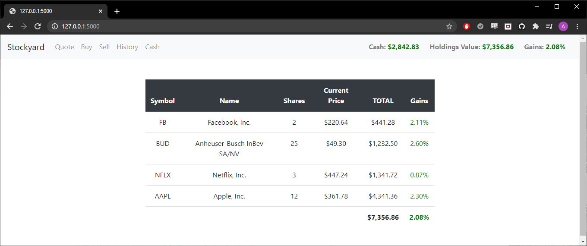
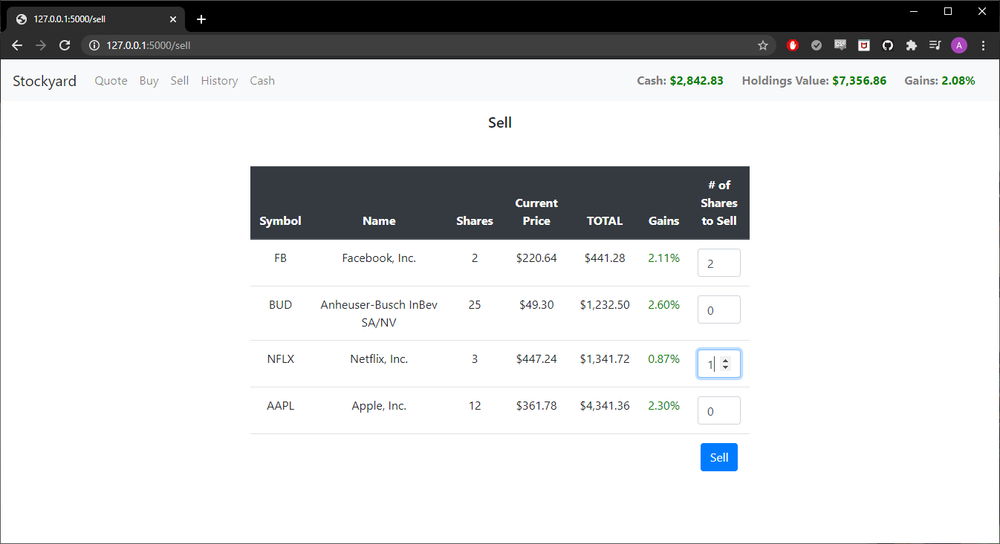
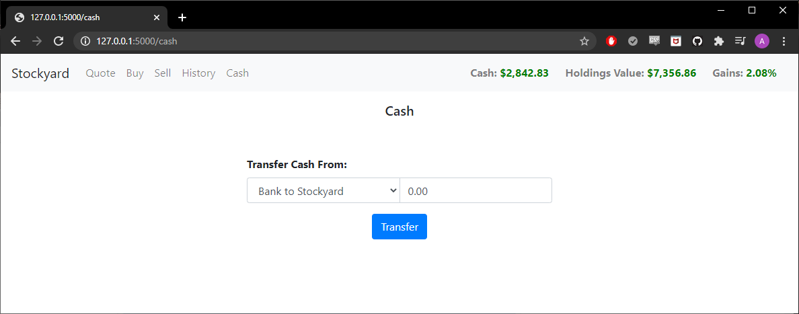
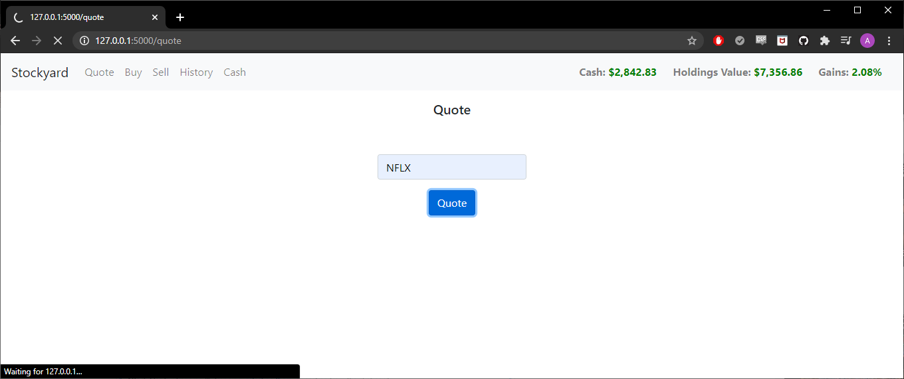

# Stock-Web-App
Buy and sell stock at actual market price - all with virtual currency.

## Technologies
This web application uses Python 3, Bootstrap 3, and Flask. It retrieves to-the-minute accurate market prices through the IEX financial data API.

## Installation
Use the package manager [pip](https://pip.pypa.io/en/stable/) to install Flask.

```bash
pip install Flask
```

Sign up for an api token at [iex](https://iexcloud.io/). Navigate to the Stock-Web-App directory,  run application.py, and enter your API token when prompted. The web application is now running locally at http://127.0.0.1:5000/!

## About

Find a summary of your holdings and their values on the summary screen.



Sell off some stock, if you'd like to free up some cash.



Or transfer (fake) cash to or from the app, if you'd like more money to play around with.



Quote stock prices before you buy or sell.


